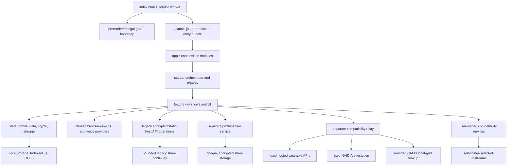

# getbased architecture

This is the human-maintained architecture contract for the getbased codebase.
Use it to decide where a module belongs, which direction dependencies should
flow, and which system boundaries a change must preserve. The generated
[`MODULE_MAP.md`](MODULE_MAP.md) is the file-level companion: it inventories
every first-party runtime module and its direct imports.

Public feature and deployment documentation remains in the separate
[`getbased-docs`](https://github.com/elkimek/getbased-docs) repository. This
file covers code ownership and dependency rules that must change with the app.

## Update contract

- Add, remove, rename, or change imports in `js/`, `api/`, `lib/`, or
  `dev-server.js`: run
  `npm run architecture:build` and commit the generated map.
- Change a module's responsibility, a major data flow, an entry point, or an
  allowed dependency direction: update this file and the architecture rules.
- Move public behavior or a user-facing contract: update the relevant page in
  `getbased-docs` as well.
- Never hand-edit `MODULE_MAP.md`. CI regenerates it and fails if it is stale.

## Runtime topology

getbased is a static browser application. Local development loads
`js/main.js` and its native ES-module graph directly. Hosted deployments run
the Rolldown production build, which collapses the static startup graph into a
hashed entry bundle and preserves lazy feature chunks. Official Vercel
functions are limited to encrypted operations and public deployment metadata.
An independently deployed Node compatibility relay owns the explicit
plaintext-operation allowlist. AI and voice provider payloads use
browser-direct routes.



The browser remains the authority for stored health data. AI, voice, and custom
provider payloads go directly from the browser to the selected provider; the
getbased-operated proxy rejects arbitrary authenticated or body-bearing
forwarding. Its compatibility allowlist contains only the Oura, Withings,
Polar, and legacy Fitbit requests used by the app, the exact NVIDIA NRAS GPU
attestation endpoint, a privacy-rounded CAMS lookup pinned to the Company-run
service, credential-free public-page reads explicitly marked by
the client, and dedicated configuration/environment helpers. The separate
compatibility relay can read allowed plaintext credentials and provider
responses while relaying them, but does not intentionally log or persist those
payloads. The static Vercel host does not receive these requests. Encrypted
share/sync envelopes remain opaque to the operator. WHOOP,
Ultrahuman, and Google Health are self-host-only and use the deployment owner's
OAuth application. Confidential token exchange and refresh use its same-origin
proxy; WHOOP and Google Health resource requests also transit it, while
Ultrahuman resource data is fetched browser-direct. No client path falls back
to getbased infrastructure.

The hosted CAMS operation is the only plaintext location route. The browser
rounds to 0.1° and the compatibility relay repeats that rounding before an
authenticated POST to the fixed `/v1/uv` service. That service performs an
in-memory lookup against its scheduled configured CAMS grid without per-request
Open-Meteo enrichment or coordinate caching. If it fails or returns sparse
fields, the browser contacts Open-Meteo directly with the rounded coordinates.
Self-hosted deployments do not inherit the Company upstream: they must set
`UVDATA_UPSTREAM`. Local development selects the fixed Company service only
when its operator explicitly supplies both that exact URL and
`UVDATA_BEARER`.

## Enforced source boundaries

The architecture checker currently enforces these coarse runtime boundaries:

| Source group | Owns | May import |
| --- | --- | --- |
| `js/` browser | Native browser application | `js/` browser modules |
| `api/` hosted API | Hosted request handlers shared by deployment entry points | `api/` and `lib/` |
| `lib/` server-shared | Node-only policy and transport | `lib/` |
| `server/compat-proxy-server.js` compatibility server | Standalone Node compatibility-relay entry point | `api/` |
| `server/profile-share-server.js` standalone server | Operator-deployed profile-share entry point | `lib/` |
| `dev-server.js` local-server | Local development entry point | `lib/` |
| `service-worker*.js` | Offline manifest and cache-routing runtime | service-worker scripts |

Relative ESM imports and classic-worker `importScripts()` dependencies are
tracked. Data files and explicitly vendored browser libraries are recorded as
repository dependencies but remain outside the executable cycle graph.
Tests and tooling may import production modules; production modules must not
import tests or tooling.

The exact rules live in [`scripts/architecture-rules.json`](scripts/architecture-rules.json)
and are enforced by `npm run architecture:check` in local and CI validation.

## Target dependency direction inside `js/`

The desired internal direction is:

```text
entry and composition
        ↓
UI and workflow orchestration
        ↓
feature/domain services
        ↓
foundation, storage adapters, and pure utilities
```

- **Entry and composition** wires the app together and may have broad fan-out.
  It should not contain feature logic.
- **UI and workflows** render, collect user intent, and coordinate services.
  They should receive browser-shell callbacks through explicit configuration
  seams rather than creating reverse imports from lower layers.
- **Feature/domain services** own health calculations, provider contracts,
  normalization, and feature-specific persistence rules.
- **Foundation and adapters** own shared state primitives, encryption,
  serialization, storage access, and dependency-free helpers. They must not
  depend on feature UI.
- `*-runtime.js`, `*-hooks.js`, and configuration functions are dependency
  inversion seams. Keep them narrow; do not turn them into alternate global
  service locators.

This fine-grained direction remains a migration target for coupling cleanup,
but the runtime graph no longer contains strongly connected components. Both
cycle ceilings are fixed at zero, so the checker rejects any new cyclic
dependency.

## Module ownership map

| Area | Typical modules | Responsibility |
| --- | --- | --- |
| Boot and shell | `main.js`, `app-*`, `startup-*`, `nav*`, `views-router*` | Startup ordering, route selection, and shell wiring |
| Foundation | `state.js`, `profile*`, `data*`, `crypto.js`, `blob-storage.js` | Active state, durable profile data, encryption, migration, and storage |
| Labs and genome | `schema*`, `adapters.js`, `marker-*`, `dna*`, `biology-score*` | Marker normalization, reference data, genetics, and deterministic scoring |
| Body | `wearables-*`, `wearable-*`, `cycle*`, `supplements*`, `supplement-*` | Device adapters, local raw rows, synced summaries, cycle context, and period-based therapy/product evidence |
| Light and environment | `light-*`, `sun-*`, `emf*` | Light measurements, spectral/session models, environment and EMF context |
| AI, voice, and knowledge | `api-*`, `provider-*`, `chat-*`, `voice-*`, `lens-*`, `pii.js` | Provider routing, prompt/context workflows, STT/TTS, RAG, transport, and PII controls |
| Sync and Agent Access | `sync-*` | Encrypted CRDT payloads, deltas, relay health, configured/paused identity lifecycle, restore preflight, and agent context |
| Import/export | `pdf-import*`, `import-*`, `export*`, `backup*` | File classification, review/commit, portable report-data snapshots, PDF/agent projections, backups, and restoration |
| Presentation | `dashboard-*`, `context-card-*`, `settings*`, `modal-*` | Views, editing surfaces, settings, accessibility, and interaction lifecycle |
| Hosted and local server runtime | `api/*`, `lib/*`, `dev-server.js` | Server-side validation, proxy transport, sharing, and repository operations |

Names express ownership, not permission to bypass the dependency direction.
When a module spans two rows, split orchestration from domain logic or inject
the higher-layer behavior through a narrow runtime seam.

## State, storage, and privacy boundaries

- `state.js` is shared in-memory session state. Do not treat it as durable
  storage or add feature callbacks to it.
- Lab marker values and ranges remain in their schema-canonical units at rest.
  `unit-profiles.js` resolves the International, Australia/New Zealand, and US
  display projections over the complete schema; conversion happens only in
  active view data and user input is converted back before persistence. See
  [`docs/unit-profiles.md`](docs/unit-profiles.md).
- Profile writes flow through profile/data persistence helpers so migrations,
  encryption, change history, and sync hooks remain consistent.
- Secrets and sensitive rows use the existing encryption and IndexedDB paths.
  Do not introduce plaintext fallbacks for OAuth tokens, AI keys, wallet
  proofs, genetics, or health records.
- Raw wearable and cycle stores remain device-local unless an explicit,
  privacy-reviewed summary surface is added to sync.
- Supplement and medication status is derived from dated periods. Product-label
  facts, a user's regimen, inactive materials, and source quality evidence stay
  separate; AI consumers use the bounded projections in `supplement-context.js`.
- A configured Sync identity may be active or paused. Pause preserves the owner,
  planner state, and dirty edits; disconnect/reset is the explicit cleanup path.
  Restored backups must publish their marked profiles before inbound tombstones
  can apply.
- Network calls use the existing provider, URL-safety, PII, same-origin, and
  proxy-policy boundaries. New direct fetch paths require an explicit review.
- UI modules render escaped/sanitized values and use the shared modal and
  delegated-action patterns; architecture cleanup must not weaken XSS or
  accessibility guards.

## Adding or changing a module

1. Choose the ownership row above and keep the filename feature-oriented.
2. Import down the target dependency direction. If that is impossible, add a
   narrow injected callback/runtime seam instead of a reverse dependency.
3. Run `npm run architecture:build` after changing the graph.
4. Inspect the `MODULE_MAP.md` diff. A new cycle or source-boundary violation
   is a design failure, not a baseline-update task.
5. Add focused behavior tests, run `npm run architecture:check`, and run the
   normal test suite.
6. Update this file only when responsibilities, boundaries, or major flows
   changed; routine file inventory changes belong only in the generated map.

## Architecture tooling and debt ratchet

- `npm run architecture:build` regenerates `MODULE_MAP.md`.
- `npm run architecture:check` verifies the generated file, resolves every
  relative ESM import, enforces source boundaries, and rejects cycle growth.
- [`scripts/architecture-cycle-baseline.json`](scripts/architecture-cycle-baseline.json)
  fixes both cycle ceilings at zero. Never raise either ceiling merely to pass
  CI; a new cycle is a design failure.

## Cold-load performance budget

`npm run performance:check` measures a fresh mobile returning-user load of
`/app` with the browser cache and service workers disabled. The committed
ceilings in [`scripts/cold-load-budget.json`](scripts/cold-load-budget.json)
cover same-origin application request count, compressed transfer bytes, and
decoded bytes. Runtime `/api/*` calls and cross-origin services are excluded so
the measurement tracks the shipped app graph rather than network availability.

The mandatory Terms/Privacy gate is prerendered at the start of `index.html`.
`legal-consent-bootstrap.js` validates current acceptance and makes a required
gate interactive before the main application graph arrives. Development loads
that bootstrap as a standalone classic script; the production build inlines
the same checked source into the HTML to avoid an extra render-blocking network
round trip. `legal-consent.js` retains the full application integration and
fallback path after startup. Both paths dispatch the same
`legal-consent-accepted` event so changelog, analytics, backup, and deep-link
destinations remain ordered behind acceptance.

The browser check runs in the normal Chromium suite and therefore in CI. Lower
the ceilings as route and feature lazy loading removes startup resources; do
not raise them to absorb an unexplained regression.

Light & Sun keeps only `light-sun-loader.js` and its small persisted-state
checks in the startup graph. The complete context, analysis, route, dashboard,
and shell-hook composition lives behind `app-light-sun-modules.js`. It loads
when the Light route or an optional Light dashboard widget is opened, when a
persisted active session needs its ticker, or alongside Chat when persisted
Light data must be present in AI context. Device preset hydration and stale
Sun-session maintenance import only the implementation needed by profiles that
actually contain those records. Visual entry points use the UI loader, which
waits for the module graph and all seven ordered Light stylesheets before
rendering. An HTML anchor preserves the original cascade position.
Marker-history controls and the context-card Ott badge keep their cross-feature
styles in their eager owning bundles, while the deferred Light stylesheets and
modules remain in the service-worker app shell for offline first use.

Settings and Tweaks are loaded through `settings-loader.js` on their first
shell, startup deep-link, or feature action. Theme-owned accent initialization
stays in `theme.js`, while the Light page imports its Sun data-source renderer
from `settings-privacy.js`; neither path requires the full Settings modal
during normal startup. The loader also fetches `css/settings.css` on first use
and waits for both resources before opening the UI. An HTML anchor preserves
the stylesheet's cascade position, while the shell-owned Settings button rule
stays in `app-shell.css`. The deferred stylesheet remains in the service-worker
app shell for offline first use.

The four optional visual themes share a conditional presentation boundary in
`theme.js`. Default dark and light startup skip `themes-extra.css`; a saved
optional theme inserts the sheet from the head bootstrap before first paint,
while later selections use the same single-flight loader. Failed action loads
restore the core dark theme and retry with a fresh URL later. The sheet remains
in the service-worker app shell for offline first use, and its HTML anchor
preserves the original final cascade position after chat redesign styles.
Cross-theme shell geometry and Sunset Mode rules remain in a final eager
inline block after that anchor, preserving their original cascade while keeping
the deferred sheet scoped to the four optional themes.

Only the persistent Chat launcher, closed panel markup, nudge state, base
shell styles, and final redesign overrides remain eager. `chat-loader.js`
single-flights the behavior composition on the first shell action, feature
prompt, keyboard shortcut, or startup deep-link. `app-chat-hooks.js` then wires
the loaded Chat graph to host callbacks injected by `app-shell-hooks.js`;
attachment handlers and the rest of the Chat runtime are not initialized
before that boundary. Failed module loads reset the single-flight state and
retry with a fresh URL. The same first action makes `chat-panel.js` load the
personality, messages, composer, onboarding, responsive, actions, and mobile
presentation sheets before opening the panel. Failed links are removed and
cache-busted for group retry, a shared HTML anchor preserves their original
order before redesign overrides, and the service worker keeps the deferred
modules and stylesheets precached for offline first use.

Voice preserves this Chat boundary. `voice-loader.js` is a small first-use
facade; microphone capture, playback, settings resolution, and provider
selection load only when dictation, Listen, or enabled auto-read is used.
Input and output retain independent provider values internally, while Settings
links them behind one Voice service choice by default and reveals the separate
values only in advanced mode. Provider metadata and capabilities live in the
provider catalog; the provider-neutral Voice service resolves settings into
adapter operations without exposing provider branches to Chat. Browser-local
Whisper and Kokoro run in dedicated module workers and download model assets
only after explicit installation. The local-server adapter calls an
OpenAI-compatible endpoint directly. BYOK cloud adapters also call their fixed
provider endpoints directly from the browser, sending the configured provider
key while omitting browser ambient credentials. As a result, getbased and its
Vercel deployment do not receive provider keys, microphone audio, or speech
text. Custom OpenAI-compatible endpoints use the same browser-direct boundary;
there is no hosted compatibility fallback, and endpoints that do not allow
browser inference fail with a user-facing configuration explanation. A
provider-scoped explicit consent gate runs before the
first cloud transcription, synthesis, or text inference request and can be
withdrawn in Settings. Microphone blobs remain ephemeral; dictation only edits
the composer, and chat panel/thread lifecycle callbacks stop tracks, synthesis,
and playback. Portable Voice preferences and cloud keys follow the existing
encrypted settings/sync path, but consent records remain browser-local.
Provider selection, local model/hardware choices, a local voice server URL, and
its optional key remain device-local. Full backups preserve preferences, but
device-key-wrapped credentials are omitted unless passphrase protection makes
them portable. One Voice settings schema owns these scopes so backup and sync
allowlists cannot drift independently.
The service worker precaches worker source but deliberately does not precache
large remote model assets.

`api.js` keeps synchronous provider selection, key state, and model metadata in
the startup graph because dashboards and feature availability checks use them.
Provider transports for Ollama, Venice, OpenRouter, Routstr, PPQ, and custom
OpenAI-compatible endpoints load through cached, retryable dynamic adapters
only when a provider operation is requested. This keeps provider behavior and
the public API facade stable without paying for every transport on a cold
dashboard load.

Wearables presentation is loaded through the single-flight stylesheet boundary
in `wearables-runtime.js` when a biometric detail, inline manual log, or the
Wearables settings tab is opened. The dashboard's compact biometric tiles and
empty manual-card shell retain their small shared rules in
`css/dashboard-data.css`, so the default dashboard paints without
`css/wearables.css`. The deferred sheet stays in the service-worker app shell
for offline first use, and its HTML anchor preserves its original cascade
position between Client List and Light & Sun.

Cycle presentation is loaded through `cycle-runtime.js`. Female Dashboard and
Body routes wait for it before rendering, and editor or import-review actions
share the same single-flight boundary. Profiles that are not female do not pay
for `css/cycle.css` on startup. Failed loads are removed and cache-busted for a
later retry; the deferred sheet stays precached for offline use and its anchor
keeps the original position between Mobile Dashboard and marker-detail styles.

Profile Sharing is loaded through `profile-share-loader.js` when a shell,
Settings, or client-list action opens it, or when startup/hash routing detects
a shared-profile link. The loader owns only lazy loading and route detection;
`profile-share.js` retains link validation, encryption, import, and UI
responsibilities. `export.js` remains shell-owned without a Data I/O
composition wrapper. Official app origins resolve profile-share requests to a
separate getbased-operated service; self-hosted origins retain their same-origin
`/api/share` contract. The shared runtime-neutral handler enforces the envelope,
expiry, size, origin, management-token, and abuse boundaries for both. The
operated service stores only opaque envelopes and minimal TTL/deletion/abuse
metadata in an isolated SQLite database; the password and decrypted profile do
not reach it. New operated-service ids use a non-overlapping `vps1_` namespace.
The Vercel adapter redirects old-client writes, serves legacy Blob reads and
deletions only within a configured window of at most 31 days, and then stops
reading Blob entirely; record migration is not required. The initial SQLite
store has no retained backup so recovery cannot resurrect stopped/expired
links, and the UI discloses that temporary copies can be lost after a service
failure.

Genome and DNA behavior stays module-eager because dashboard summaries,
recommendations, startup catalog hydration, and import routing share it.
`dna-runtime.js` owns the narrower presentation boundary: `css/genetics.css`
loads when the Genome route or a DNA preview/manual-entry surface first opens.
Every styled entry waits for the stylesheet, concurrent calls share one
request, failed links are removed and cache-busted for retry, and route/action
failures remain contained with an explanatory status. An HTML anchor preserves
the original cascade position, while dashboard genome tiles remain in the
eager `dashboard-data.css` bundle. The service-worker app shell retains the
deferred stylesheet for offline first use.

Category, Compare, and Correlations behavior stays module-eager for route
compatibility, but `category-page-runtime.js` loads `css/category-views.css`
when one of those routes first opens. Each route waits for the stylesheet
before rendering, concurrent route entries share one request, failed links are
removed and cache-busted for retry, and an HTML anchor preserves the original
cascade position. Dashboard greeting spacing, alert cards, and date-range
controls remain in eager dashboard bundles because the returning-user dashboard
renders them without entering a category-backed route. The service-worker app
shell retains the deferred stylesheet for offline first use.

Client List remains module-eager because shell, profile, and location actions
use it, but `css/client-list.css` loads only when `openClientList()` is first
called. Opening waits for the stylesheet, concurrent opens share one request,
and a failed request is removed so the next open can retry. An HTML anchor
preserves the stylesheet's cascade position, and the service-worker app shell
retains it for offline first use.

Import review presentation loads through `import-loader.js` on the first file
input/drop interaction, pending-draft restoration, or direct cycle-import
preview. The generic action buttons, header import status, and empty-Labs drop
zone remain in `app-shell.css` because non-import features and startup routes
use them. Concurrent stylesheet requests share one load, failures are removed
for retry, an HTML anchor preserves cascade order, and the service-worker app
shell retains `css/import.css` for offline first use.

Marker detail, manual-entry, and custom-marker presentation remains
module-eager because dashboard, category, Biology Score, and sync refresh paths
share its behavior, but `css/marker-detail-modal.css` loads only when one of
those modal surfaces first opens through its already-eager runtime adapter. The
entry waits for the stylesheet so an unstyled modal is never shown, concurrent
requests share one load, failed links are removed and cache-busted for retry,
and an HTML anchor preserves the original cascade position before
Recommendations. The service-worker app shell retains the stylesheet for
offline first use.

The EMF assessment module and `css/emf.css` load together through
`emf-runtime.js` when an EMF editor entry point is first used. Cross-feature
launchers keep their presentation in their eager owning bundles, so the
deferred stylesheet contains only EMF editor and interpretation UI. Opening
waits for both resources, concurrent stylesheet requests share one load, and a
failed link is removed and cache-busted for retry. An HTML anchor preserves
the original cascade position, and the service-worker app shell retains the
stylesheet for offline first use.
