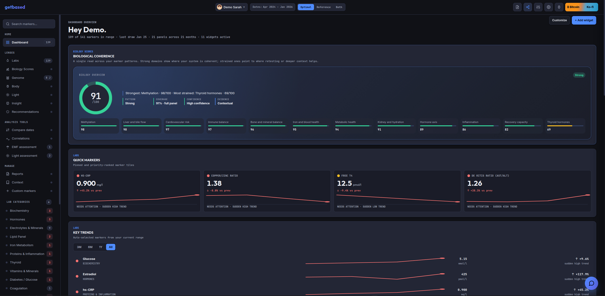

# getbased — personal health intelligence, under your control

**getbased** is an open-source health dashboard for people who want to understand their own biology without handing the whole record to a black-box health app. It brings labs, DNA, wearables, light exposure, lifestyle context, notes, and optional AI analysis into one browser-based workspace.

You can use it with no account. Most data lives in your browser by default. Health-data network features — AI providers, encrypted sync, profile sharing, external Knowledge Bases, and Agent Access — are opt-in. On the hosted app, cookieless anonymous pageview and outbound affiliate-click counts are enabled by default; they contain no health data and can be disabled in **Settings → Privacy**.

**[Live app](https://app.getbased.health)** · **[Documentation](https://docs.getbased.health)** · **[Discord](https://discord.gg/zJdVB9zgQB)** · **[Nostr](https://njump.me/npub13xgjkyve82xesxxzvy52vz99z5fcuusda4cytekct2tw800kepas498nt2)**



---

## What you can do with it

- **Import lab reports** — drop PDFs, images, spreadsheets, or manually enter values. getbased maps known markers, lets you review/edit rows before saving, and keeps report snapshots per file.
- **Track biomarkers over time** — charts, tables, heatmaps, reference ranges, optimal ranges, notes per value, trend flags, compare-dates view, and calculated markers like HOMA-IR, lipid ratios, NLR/PLR, De Ritis, and hs-CRP/HDL.
- **Read biology as patterns, not isolated numbers** — Biology Scores summarize deterministic marker patterns such as metabolism, thyroid, cardiovascular health, inflammation, methylation, iron/blood, hormones, stress resilience, cellular energy, gut-immune terrain, and Biological Coherence. They are pattern summaries, not diagnoses.
- **Bring in DNA context** — raw DNA imports from common consumer and clinical formats, with curated SNP interpretation, APOE haplotype support, mtDNA haplogroups, and DNA-aware AI context.
- **Connect wearables and body metrics** — Oura, Withings, Fitbit, Polar, Apple Health file import, plus WHOOP and Ultrahuman where enabled. Manual weight, blood pressure, and resting pulse work without a wearable.
- **Track light and environment** — sun sessions, UV/atmospheric context, indoor light setup, devices, measurements, EMF assessment, and daily light analysis.
- **Add the missing human context** — medical history, family history, diet/digestion, sleep, exercise, stress, light/circadian habits, environment, EMF, supplements, medications, health goals, cycle tracking, and freeform notes.
- **Ask AI with context** — chat can use your labs, notes, scores, wearables, Knowledge Base passages, and selected interpretive lens. Dictate into the composer and listen to replies with either browser-local voice models, a local compatible server, xAI, or ElevenLabs.
- **Build reports** — export a practitioner-readable PDF with selected labs, context, and summary sections.
- **Use multiple profiles** — separate profiles for yourself, family, clients, or test/demo data.
- **Protect and move your data** — create full backups, optionally encrypt browser storage with a passphrase, sync encrypted profiles across devices, or share a password-protected copy.

## The five spaces

| Space | What it is for |
|---|---|
| **Labs** | Biomarkers, imports, charts, tables, marker notes, manual entry, calculated values, specialty tests. |
| **Genome** | Raw DNA import, APOE, mtDNA, curated SNP context, and genetic factors that influence interpretation. |
| **Body** | Wearables, manual biometrics, recovery, sleep, body composition, supplements, medications, cycle tracking. |
| **Light** | Sun exposure, UV context, screens/devices, indoor light, room measurements, EMF, and circadian habits. |
| **Insight** | AI chat, Current Focus, Biology Scores, recommendations, Knowledge Base, interpretive lenses, and synthesis. |

## Privacy model

getbased is private by default, not magic. The boundary depends on which features you turn on.

- **No account required.** You can open the app and work locally.
- **Browser-first storage.** Profile data is stored in localStorage and IndexedDB by default.
- **Optional encryption at rest.** A passphrase-derived key can protect browser storage.
- **Optional AI.** PDF import and chat need either an AI provider or a local OpenAI-compatible server. Non-AI tracking features still work without one.
- **Optional Voice.** On-device Whisper/Kokoro keep recordings and message text in the browser after model download. A selected local server receives them directly. xAI or ElevenLabs receives only the recording or message explicitly processed with that cloud provider.
- **PII review for text imports.** Deterministic patterns and an optional trusted self-hosted model can strip likely identifiers before lab text is sent to an AI provider. Automated detection can miss unusual layouts, so review is still recommended. Image imports cannot be scrubbed and always show a separate warning before upload.
- **Optional encrypted sync.** Cross-device sync uses Evolu CRDT storage and end-to-end encrypted profile payloads.
- **Optional sharing.** Profile sharing creates an encrypted, password-protected copy for someone else.
- **Optional Agent Access.** External agents receive only the context you enable, via an encrypted relay flow and a local decryption key.
- **Anonymous hosted-app usage stats.** Cookieless pageview and outbound affiliate-click counts are enabled by default. No health data, viewed records, identity, or health context is sent, and analytics can be disabled in **Settings → Privacy**.

If you want the strictest setup, use an AI server on the same device, disable analytics, and leave sync, sharing, Agent Access, connected wearable integrations, external Knowledge Bases, and other remote data sources off.

## AI providers

All normal tracking works without AI. AI features can use:

| Provider path | What it is for |
|---|---|
| **PPQ** | Private TEE mode and regular hosted models, with in-app balance/top-up support. |
| **Routstr** | Decentralized Bitcoin AI through Nostr-discovered nodes and the built-in Cashu wallet. |
| **OpenRouter** | A broad hosted model marketplace with OAuth or manual key setup. |
| **Venice AI** | Hosted models with optional browser-side message encryption and limited client attestation checks. |
| **Local AI** | Any OpenAI-compatible local server, such as Ollama, LM Studio, Jan, or llama.cpp. |
| **Custom API** | Bring your own OpenAI-compatible endpoint or proxy. |

Switch providers in Settings. Provider keys are stored locally in the browser.

## Voice

Voice input and output use one service by default in **Settings → Voice**. An
advanced toggle can select different services for dictation and spoken replies,
for example on-device Whisper input with ElevenLabs output:

- **On this device** uses quantized multilingual Whisper Small by default and offers Large v3 Turbo for high-end hardware. Local transcription and Kokoro speech can use CPU/WASM or a validated WebGPU path. Automatic processing starts with the broadly compatible CPU path, records normalized timings, and selects the fastest tested backend. Each required CPU or GPU model variant downloads only after explicit confirmation and runs in a dedicated Web Worker. Built-in speech currently offers English US and UK voices. Markdown tables are skipped with a short spoken notice so the surrounding explanation remains easy to follow.
- **Local voice server** connects directly to an OpenAI-compatible `/v1/audio/transcriptions` and `/v1/audio/speech` server, including apps such as LocalAI or Speaches when configured with compatible models.
- **xAI** and **ElevenLabs** use your own API key. There is no delegated account sign-in for these integrations; keys use the same optional encrypted-at-rest storage as other provider secrets.

Microphone audio is held only for the active transcription. Dictation inserts text at the composer cursor and never sends a message automatically. Assistant messages expose a **Listen** control, and recording or playback stops when the chat closes or switches conversations.

## Knowledge Base and interpretive lenses

The **Knowledge Base** lets AI ground answers in your own documents instead of relying only on model memory. It supports:

- an in-browser local library for documents indexed on this device;
- an external knowledge server for larger or shared libraries;
- citations/snippets injected into chat and Current Focus when relevant.

The **Interpretive Lens** is different: it changes the framing of analysis. For example, you can ask the AI to read the same labs through a mitochondrial, endocrinology, circadian, or other scientific lens.

## Agent Access

Agent Access is for using your getbased context from external AI tools — Hermes Agent, OpenClaw, Claude Code, Claude Desktop, Cursor, Cline, Codex CLI, or another MCP-compatible client.

How it works:

1. Enable **Cross-device Sync**.
2. Enable **Settings → Agent Access**.
3. Pick the target client.
4. Copy the private setup command.
5. Paste it into that agent's terminal.

The public installer provides one-command setup on Linux:

```bash
curl -fsSL https://getbased.health/install.sh | bash
```

This installs the local agent stack only. On macOS, Windows, and WSL1, follow the [manual Agent Access setup](https://docs.getbased.health/guides/agent-access) instead; the installer cannot configure systemd user services there.

Private access requires the setup command copied from the app:

```bash
curl -fsSL https://getbased.health/install.sh | bash -s -- connect <target> --setup 'gbsetup_v1_...'
```

That setup payload contains the read-only relay token and the local Agent Context key. Do not paste real setup values into logs, issues, or public docs.

## Local development

Requires Node.js 24.

```bash
git clone https://github.com/elkimek/get-based
cd get-based
npm ci
npm run dev-server
```

Open `http://localhost:8000/app`. The root URL may serve the sibling `get-based-site` landing page when that repository is present.

Useful checks:

```bash
npm run typecheck
npm run typecheck:checkjs
npm run architecture:check
npm run vendor:check
npm run supply-chain:check
npm run sbom
npm run quality
npm test -- tests/<relevant-test>.test.js
npx playwright test tests/playwright/<relevant-spec>.spec.js
npm run test:firefox
npm run performance:check
npm run production:check
```

Default to tests related to the current change. GitHub Actions runs the exhaustive browser and combined-coverage matrix so local development does not repeatedly create high volumes of temporary Chromium and V8 coverage data.
`./run-tests.sh` runs both type checkers, verifies the architecture map, vendored browser assets and their supply-chain inventory, and the static module graph, starts an isolated local server, runs the Node/Vitest tests, checks the dev-server origin guard, and runs every Playwright browser assertion. It is blocked outside CI unless the high-write run is explicitly acknowledged with `GETBASED_ALLOW_HIGH_WRITE_TESTS=1`.
`COVERAGE=1 ./run-tests.sh` also combines Vitest and Playwright V8 function coverage and enforces the committed ratchet in `scripts/coverage-baseline.json`; CI runs this mode on every change.
`npm run test:firefox` runs the focused Firefox critical-flow suite; install its browser binary once with `npx playwright install firefox`.
`npm run performance:check` runs the focused cold mobile-load check and enforces the committed request-count, compressed-transfer, and decoded-byte ceilings.
`npm run production:check` builds the deploy artifact in a temporary directory and enforces the production startup, lazy-chunk, and PWA app-shell precache resource/decoded-byte budgets without changing the worktree.
`npm run sbom` writes a combined CycloneDX inventory for npm and vendored browser components to `artifacts/getbased.cdx.json`.

## Tech stack

- Native browser ES modules in source; the Vercel build uses Rolldown to collapse
  the static startup graph while preserving feature-level lazy chunks.
- Plain HTML/CSS/JS with split modules under `js/` and feature CSS under `css/`.
- Chart.js for charts.
- pdf.js for PDF text extraction.
- transformers.js + OPFS for the in-browser Knowledge Base.
- transformers.js, quantized Whisper Large v3 Turbo/Small, and Kokoro for optional in-browser voice.
- Evolu for optional encrypted CRDT sync.
- Vercel serverless endpoints for provider proxying, OAuth callbacks, profile sharing, and related hosted edges.
- Vitest, TypeScript checkers, quality guardrails, and Playwright for verification.
- PWA install support; core local tracking and cached app data work offline. Integrations, synchronization, sharing, remote Knowledge Bases, and live environmental data require connectivity.

## Repo structure

```text
get-based/
├── index.html, styles.css, css/     # App shell and feature styles
├── service-worker.js                # PWA caching, offline shell, and network routing
├── js/                              # Native ES modules
│   ├── settings-agent-access-panel.js
│   ├── sync*.js                     # Optional encrypted sync and Agent Access plumbing
│   ├── lens*.js                     # Knowledge Base backends and query injection
│   ├── biology-score*.js            # Biology Scores engine, UI, and AI context
│   ├── wearables*.js                # Wearable adapters, storage, settings, summaries
│   └── light*.js / sun*.js          # Light & Sun tools, sessions, environment, AI summaries
├── api/                             # Vercel/serverless routes
├── lib/                             # Node-only server policy and transport
├── data/                            # Curated marker, SNP, lens, and reference data
├── brands/                          # Product and provider brand assets
├── scripts/                         # Architecture, vendor, catalog, and maintenance tooling
├── tests/                           # Vitest and Playwright coverage
├── vendor/                          # Vendored browser libraries
├── ARCHITECTURE.md                  # Maintained ownership and dependency contract
├── MODULE_MAP.md                    # Generated runtime module/import map
└── .github/workflows/               # CI
```

User and developer documentation live at [docs.getbased.health](https://docs.getbased.health). The app repo keeps only code-adjacent notes and tests.

## Related repos

- [**getbased-docs**](https://github.com/elkimek/getbased-docs) — public user and developer documentation.
- [**getbased-agents**](https://github.com/elkimek/getbased-agents) — MCP adapter, local knowledge server, dashboard, and `getbased-stack` installer.
- [**getbased-relay**](https://github.com/elkimek/getbased-relay) — Evolu sync relay and Agent Access context gateway.
- [**get-based-site**](https://github.com/elkimek/get-based-site) — landing page, public installer, `llms.txt`, and agent discovery files.

## Contributing

See [CONTRIBUTING.md](CONTRIBUTING.md). Project board: [planned features](https://github.com/users/elkimek/projects/2).

## Star History

<a href="https://www.star-history.com/?repos=elkimek%2Fget-based">
 <picture>
   <source media="(prefers-color-scheme: dark)" srcset="https://api.star-history.com/chart?repos=elkimek/get-based&type=date&theme=dark&legend=top-left&sealed_token=tR0YBBg7mhV8DAAqVCwu7vt6fpm6DyNMF7EYWIjNXxpTE8uiBRf0W1EDP0IiEu7Ov6gMA46kNxfZyJvUK_sJejxhtNCbmYRK1tzjtJ57CF8vn-mZ_MvxXEFnfC7nK1Dwpc90Uius9o0_sSqP5Jfq1xMuUrJLLgNNML6uvlTILTno7HO-M5H7ukKpPaY5" />
   <source media="(prefers-color-scheme: light)" srcset="https://api.star-history.com/chart?repos=elkimek/get-based&type=date&legend=top-left&sealed_token=tR0YBBg7mhV8DAAqVCwu7vt6fpm6DyNMF7EYWIjNXxpTE8uiBRf0W1EDP0IiEu7Ov6gMA46kNxfZyJvUK_sJejxhtNCbmYRK1tzjtJ57CF8vn-mZ_MvxXEFnfC7nK1Dwpc90Uius9o0_sSqP5Jfq1xMuUrJLLgNNML6uvlTILTno7HO-M5H7ukKpPaY5" />
   
 </picture>
</a>

## License

AGPL-3.0-or-later. See [LICENSE](LICENSE).

If you run a modified version as a network service, AGPLv3 §13 requires you to offer users the corresponding source. Vendored third-party libraries are listed under their own licenses in [THIRD_PARTY_LICENSES.md](THIRD_PARTY_LICENSES.md).
