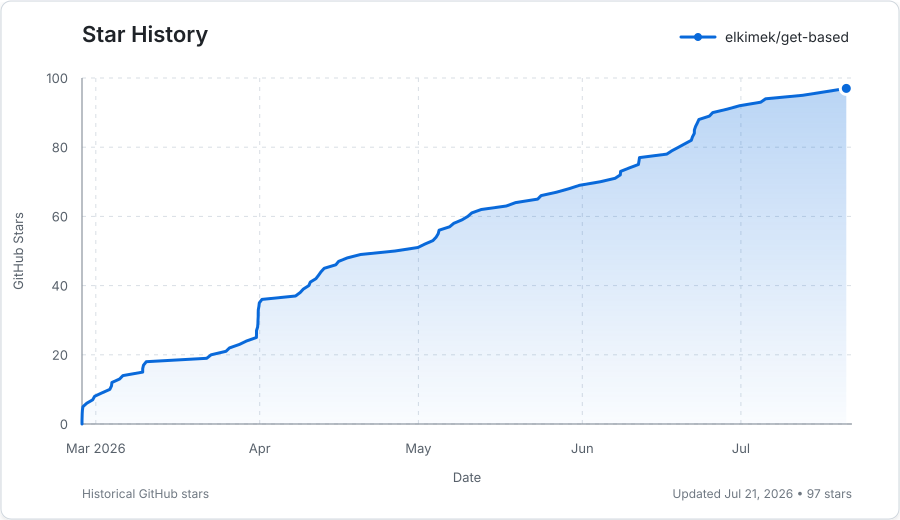

# getbased — personal health intelligence, under your control

**getbased** is an open-source health dashboard for people who want to understand their own biology without handing the whole record to a black-box health app. It brings labs, DNA, wearables, light exposure, lifestyle context, notes, and optional AI analysis into one browser-based workspace.

You can use it with no account. Most data lives in your browser by default. Network features — AI providers, encrypted sync, profile sharing, Knowledge Base, and Agent Access — are opt-in.

**[Live app](https://app.getbased.health)** · **[Documentation](https://docs.getbased.health)** · **[Discord](https://discord.gg/zJdVB9zgQB)** · **[Nostr](https://njump.me/npub13xgjkyve82xesxxzvy52vz99z5fcuusda4cytekct2tw800kepas498nt2)**


---

## What you can do with it

- **Import lab reports** — drop PDFs, images, spreadsheets, or manually enter values. getbased maps known markers, lets you review/edit rows before saving, and keeps report snapshots per file.
- **Track biomarkers over time** — charts, tables, heatmaps, reference ranges, optimal ranges, notes per value, trend flags, compare-dates view, and calculated markers like HOMA-IR, lipid ratios, NLR/PLR, De Ritis, and hs-CRP/HDL.
- **Read biology as patterns, not isolated numbers** — Biology Scores summarize deterministic marker patterns such as metabolism, thyroid, cardiovascular health, inflammation, methylation, iron/blood, hormones, stress resilience, cellular energy, gut-immune terrain, and Biological Coherence. They are pattern summaries, not diagnoses.
- **Bring in DNA context** — raw DNA imports from common consumer and clinical formats, with curated SNP interpretation, APOE haplotype support, mtDNA haplogroups, and DNA-aware AI context.
- **Connect wearables and body metrics** — Oura, Withings, Fitbit, Polar, Apple Health file import, plus WHOOP and Ultrahuman where enabled. Manual weight, blood pressure, and resting pulse work without a wearable.
- **Track light and environment** — sun sessions, UV/atmospheric context, indoor light setup, devices, measurements, EMF assessment, and daily light analysis.
- **Add the missing human context** — medical history, family history, diet/digestion, sleep, exercise, stress, light/circadian habits, environment, EMF, supplements, medications, health goals, cycle tracking, and freeform notes.
- **Ask AI with context** — chat can use your labs, notes, scores, wearables, Knowledge Base passages, and selected interpretive lens. It can also read attached images when your provider supports it.
- **Build reports** — export a practitioner-readable PDF with selected labs, context, and summary sections.
- **Use multiple profiles** — separate profiles for yourself, family, clients, or test/demo data.

## The five spaces

| Space | What it is for |
|---|---|
| **Labs** | Biomarkers, imports, charts, tables, marker notes, manual entry, calculated values, specialty tests. |
| **Genome** | Raw DNA import, APOE, mtDNA, curated SNP context, and genetic factors that influence interpretation. |
| **Body** | Wearables, manual biometrics, recovery, sleep, body composition, supplements, medications, cycle tracking. |
| **Light** | Sun exposure, UV context, screens/devices, indoor light, room measurements, EMF, and circadian habits. |
| **Insight** | AI chat, Current Focus, Biology Scores, recommendations, Knowledge Base, interpretive lenses, and synthesis. |

## Privacy model

getbased is private by default, not magic. The boundary depends on which features you turn on.

- **No account required.** You can open the app and work locally.
- **Browser-first storage.** Profile data is stored in localStorage and IndexedDB by default.
- **Optional encryption at rest.** A passphrase-derived key can protect browser storage.
- **Optional AI.** PDF import and chat need either an AI provider or a local OpenAI-compatible server. Non-AI tracking features still work without one.
- **PII review for imports.** Personal info can be stripped from lab text before it is sent to an AI provider.
- **Optional encrypted sync.** Cross-device sync uses Evolu CRDT storage and end-to-end encrypted profile payloads.
- **Optional sharing.** Profile sharing creates an encrypted, password-protected copy for someone else.
- **Optional Agent Access.** External agents receive only the context you enable, via an encrypted relay flow and a local decryption key.
- **Optional anonymous usage stats.** Analytics can be disabled in Settings.

If you want the strictest setup, use a local AI server and keep sync, sharing, and Agent Access off.

## AI providers

All normal tracking works without AI. AI features can use:

| Provider path | What it is for |
|---|---|
| **PPQ** | Private TEE mode and regular hosted models, with in-app balance/top-up support. |
| **Routstr** | Decentralized Bitcoin AI through Nostr-discovered nodes and the built-in Cashu wallet. |
| **OpenRouter** | A broad hosted model marketplace with OAuth or manual key setup. |
| **Venice AI** | Hosted models with optional browser-side message encryption and limited client attestation checks. |
| **Local AI** | Any OpenAI-compatible local server, such as Ollama, LM Studio, Jan, or llama.cpp. |
| **Custom API** | Bring your own OpenAI-compatible endpoint or proxy. |

Switch providers in Settings. Provider keys are stored locally in the browser.

## Knowledge Base and interpretive lenses

The **Knowledge Base** lets AI ground answers in your own documents instead of relying only on model memory. It supports:

- an in-browser local library for documents indexed on this device;
- an external knowledge server for larger or shared libraries;
- citations/snippets injected into chat and Current Focus when relevant.

The **Interpretive Lens** is different: it changes the framing of analysis. For example, you can ask the AI to read the same labs through a mitochondrial, endocrinology, circadian, or other scientific lens.

## Agent Access

Agent Access is for using your getbased context from external AI tools — Hermes Agent, OpenClaw, Claude Code, Claude Desktop, Cursor, Cline, Codex CLI, or another MCP-compatible client.

How it works:

1. Enable **Cross-device Sync**.
2. Enable **Settings → Agent Access**.
3. Pick the target client.
4. Copy the private setup command.
5. Paste it into that agent's terminal.

The public installer:

```bash
curl -fsSL https://getbased.health/install.sh | bash
```

installs the local agent stack only. Private access requires the setup command copied from the app:

```bash
curl -fsSL https://getbased.health/install.sh | bash -s -- connect <target> --setup 'gbsetup_v1_...'
```

That setup payload contains the read-only relay token and the local Agent Context key. Do not paste real setup values into logs, issues, or public docs.

## Local development

```bash
git clone https://github.com/elkimek/get-based
cd get-based
npm install
node dev-server.js
```

Open `http://localhost:8000`.

Useful checks:

```bash
npm run typecheck
npm run typecheck:checkjs
npm run quality
npm test
./run-tests.sh
```

`./run-tests.sh` starts a local server, runs the Node/Vitest tests, checks the dev-server origin guard, and runs Playwright browser assertions.

## Tech stack

- Native browser ES modules; no app bundler for runtime source.
- Plain HTML/CSS/JS with split modules under `js/` and feature CSS under `css/`.
- Chart.js for charts.
- pdf.js for PDF text extraction.
- transformers.js + OPFS for the in-browser Knowledge Base.
- Evolu for optional encrypted CRDT sync.
- Vercel serverless endpoints for provider proxying, OAuth callbacks, profile sharing, and related hosted edges.
- Vitest, TypeScript checkers, quality guardrails, and Playwright for verification.
- PWA install support; non-AI features work offline once loaded.

## Repo structure

```text
get-based/
├── index.html, styles.css, css/     # App shell and feature styles
├── js/                              # Native ES modules
│   ├── settings-agent-access-panel.js
│   ├── sync*.js                     # Optional encrypted sync and Agent Access plumbing
│   ├── lens*.js                     # Knowledge Base backends and query injection
│   ├── biology-score*.js            # Biology Scores engine, UI, and AI context
│   ├── wearables*.js                # Wearable adapters, storage, settings, summaries
│   └── light*.js / sun*.js          # Light & Sun tools, sessions, environment, AI summaries
├── api/                             # Vercel/serverless routes
├── lib/                             # Node-only server policy and transport
├── tests/                           # Vitest and Playwright coverage
├── vendor/                          # Vendored browser libraries
├── ARCHITECTURE.md                  # Maintained ownership and dependency contract
├── MODULE_MAP.md                    # Generated runtime module/import map
└── .github/workflows/               # CI
```

User and developer documentation live at [docs.getbased.health](https://docs.getbased.health). The app repo keeps only code-adjacent notes and tests.

## Related repos

- [**getbased-docs**](https://github.com/elkimek/getbased-docs) — public user and developer documentation.
- [**getbased-agents**](https://github.com/elkimek/getbased-agents) — MCP adapter, local knowledge server, dashboard, and `getbased-stack` installer.
- [**getbased-relay**](https://github.com/elkimek/getbased-relay) — Evolu sync relay and Agent Access context gateway.
- [**get-based-site**](https://github.com/elkimek/get-based-site) — landing page, public installer, `llms.txt`, and agent discovery files.

## Contributing

See [CONTRIBUTING.md](CONTRIBUTING.md). Project board: [planned features](https://github.com/users/elkimek/projects/2).

## Star History



## License

AGPL-3.0-or-later. See [LICENSE](LICENSE).

If you run a modified version as a network service, AGPLv3 §13 requires you to offer users the corresponding source. Vendored third-party libraries are listed under their own licenses in [THIRD_PARTY_LICENSES.md](THIRD_PARTY_LICENSES.md).
